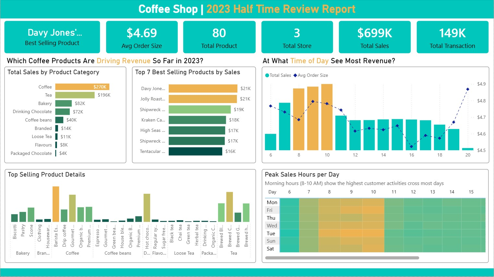

# Coffee Shop 2023 Half Time Review Dashboard

## Project Overview
This Power BI dashboard analyzes the Coffee Shop's sales performance for the first half of 2023.  
It provides insights into revenue trends, best-selling products, peak sales hours, and customer behavior patterns.

---

## Key Business Questions
- Which coffee products are driving revenue in 2023?
- What time of day generates the most revenue?
- Which product categories perform best?
- What are the peak sales hours across the week?

---

## Key Insights

- Total Sales: $699K
- Total Transactions: 149K
- Average Order Size: $4.69
- Total Stores: 3
- Total Products: 80

### Top Performing Category
- Coffee ($270K)

### Peak Sales Hours
- Morning hours (8 AM – 10 AM) generate the highest revenue across most days.

---

## Dashboard Preview

---

## Tools Used
- Microsoft Power BI
- DAX
- Data Modeling
- Data Cleaning & Transformation

---

## Project Structure
coffee-shop-2023-dashboard/
│
├── data/

├── report/

├── images/

├── Coffee_Shop_Dashboard.pbix

└── README.md

---

## How to Use
1. Download the `.pbix` file.
2. Open with Microsoft Power BI Desktop.
3. Explore interactive visualizations.

---

## 📌 Author
Ye Htet Hein  
Data Analyst | Business Intelligence Enthusiast
